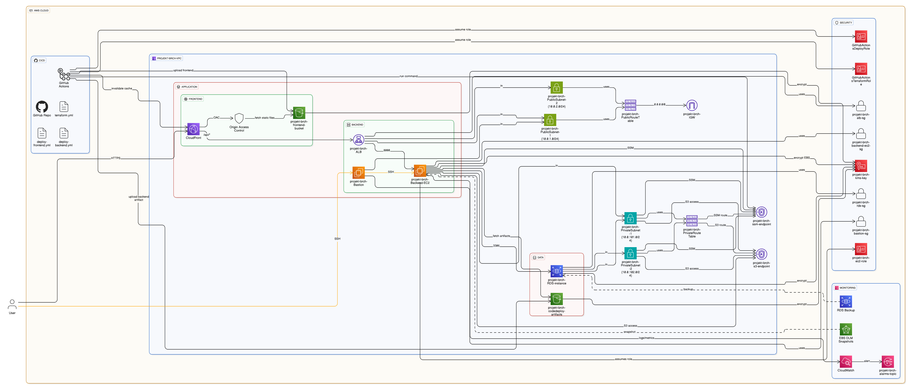

# Projekt Bezpiecznej Infrastruktury w Chmurze AWS

## 1. Opis Projektu

Celem projektu jest wdrożenie prostej aplikacji internetowej (React + Django) w chmurze AWS, z silnym naciskiem na bezpieczeństwo i automatyzację. Infrastruktura jest w pełni zarządzana jako kod (IaC) za pomocą Terraform, a procesy wdrożeniowe są zautomatyzowane dzięki pipeline'om CI/CD w GitHub Actions.

Projekt demonstruje implementację kluczowych mechanizmów bezpieczeństwa, takich jak segmentacja sieci, zasada minimalnych uprawnień, szyfrowanie danych, monitoring i automatyczne backupy.

### Część Aplikacyjna (Co zabezpieczamy?)

- **Frontend**: Prosta aplikacja typu Single Page Application (SPA) zbudowana w React.
- **Backend**: API REST napisane w Django, udostępniające podstawowe operacje CRUD na "itemach".
- **Baza Danych**: Baza danych MySQL zarządzana przez usługę AWS RDS.
- **Storage**: Bucket S3 do hostowania statycznych plików aplikacji frontendowej.

### Część Bezpieczeństwa (Jak to zabezpieczamy?)

Poniższe sekcje szczegółowo opisują zaimplementowane mechanizmy bezpieczeństwa, odnosząc się do konkretnych wymagań.

## 2. Architektura Rozwiązania

Poniżej przedstawiono diagram architektury rozwiązania:

Infrastruktura została zaprojektowana zgodnie z najlepszymi praktykami AWS, aby zapewnić izolację zasobów i kontrolowany przepływ danych.

- **VPC**: Dedykowana sieć wirtualna (`10.0.0.0/16`) z podziałem na strefy publiczne i prywatne.
- **Podsieci Prywatne**:
  - **Instancja EC2 Backendu**: Serwer aplikacyjny Django działa na maszynie wirtualnej w podsieci prywatnej, bez bezpośredniego dostępu z internetu.
  - **Baza Danych RDS**: Baza danych MySQL jest umieszczona w podsieciach prywatnych, dostępna tylko dla serwera backendu.
- **Podsieci Publiczne**:
  - **Application Load Balancer (ALB)**: Publicznie dostępny load balancer, który przyjmuje ruch HTTP/HTTPS i kieruje go do serwera backendu. Jest to jedyny punkt wejścia do aplikacji.
  - **Host Bastionowy**: Instancja EC2 w podsieci publicznej, służąca jako bezpieczny punkt dostępu (jump host) do zarządzania serwerem backendu przez SSH.
- **CloudFront + S3**: Aplikacja frontendowa jest hostowana w prywatnym buckecie S3, a dystrybucją zarządza CloudFront, który pełni rolę CDN i zapewnia dostęp przez HTTPS.
- **VPC Endpoints**: Umożliwiają zasobom w podsieciach prywatnych bezpieczną komunikację z usługami AWS (np. S3, SSM) bez wychodzenia do publicznego internetu. **W tej architekturze nie użyto NAT Gateway.**

## 3. Implementacja Mechanizmów Bezpieczeństwa

### Zarządzanie Dostępem (TK07)

- **Zasada Minimalnych Uprawnień (Least Privilege)**: Zamiast używać konta root, stworzono dedykowane role IAM z minimalnymi, precyzyjnie zdefiniowanymi uprawnieniami.
  - **Rola dla Terraform (`GitHubActionsTerraformRole`)**: Posiada szerokie uprawnienia (`AdministratorAccess`) do zarządzania infrastrukturą, ale jest przypisana tylko do workflow `terraform.yml` w GitHub Actions.
  - **Rola dla Wdrożeń (`GitHubActionsDeployRole`)**: Posiada uprawnienia tylko do S3 (upload artefaktów), CloudFront (inwalidacja cache) i SSM (zdalne wykonanie skryptu). Jest używana przez workflowy `deploy-backend.yml` i `deploy-frontend.yml`.
  - **Rola dla EC2 (`projekt-brch-ec2-role`)**: Przypisana do instancji backendu, nadaje uprawnienia do wysyłania logów do CloudWatch, komunikacji z SSM oraz pobierania artefaktów z S3.
- **Federacja Tożsamości z GitHub Actions**: Dostęp dla pipeline'ów CI/CD jest realizowany za pomocą OIDC (OpenID Connect), co eliminuje potrzebę przechowywania długoterminowych kluczy dostępowych AWS jako sekrety w GitHub. Role IAM ufają tylko konkretnemu repozytorium i branchowi (`main`).

### Bezpieczeństwo i Segmentacja Sieci (TK02, TK03, TK06, TK07)

- **Segmentacja Sieci**: Infrastruktura jest podzielona na podsieci publiczne i prywatne. Krytyczne komponenty (baza danych, serwer aplikacyjny) są odizolowane w podsieciach prywatnych.
- **Grupy Zabezpieczeń (Security Groups)**: Działają jak stanowa zapora sieciowa dla zasobów.
  - **ALB SG**: Zezwala na ruch przychodzący na portach 80/443 z internetu (`0.0.0.0/0`).
  - **Bastion SG**: Zezwala na ruch SSH (port 22) tylko z zaufanego adresu IP administratora (zmienna `my_ip_cidr`).
  - **Backend EC2 SG**: Zezwala na ruch na porcie 8000 (Django) tylko z ALB oraz na porcie 22 (SSH) tylko z hosta bastionowego.
  - **RDS SG**: Zezwala na ruch na porcie 3306 (MySQL) tylko z grupy zabezpieczeń backendu EC2.
- **Dostęp do Świata Zewnętrznego**: Dostęp do serwera WWW jest realizowany przez Application Load Balancer. Dostęp administracyjny do serwera backendu jest możliwy tylko przez host bastionowy.

### Szyfrowanie Danych (TK08)

- **Szyfrowanie w Spoczynku (At Rest)**: Wszystkie dane są szyfrowane.
  - **Dyski EBS**: Wolumeny root dla instancji EC2 (Bastion i Backend) są szyfrowane.
  - **Baza Danych RDS**: Instancja RDS ma włączone szyfrowanie.
  - **Buckety S3**: Wszystkie buckety (frontend, artefakty) mają włączone szyfrowanie po stronie serwera (SSE-KMS).
- **Zarządzanie Kluczami (KMS)**: Stworzono dedykowany klucz KMS (`projekt-brch-kms-key`), który jest używany do szyfrowania wszystkich powyższych zasobów. Polityka klucza precyzyjnie określa, które role i usługi mogą go używać.

### Monitoring i Backupy (TK05, TK04)

- **Monitoring (CloudWatch)**: Skonfigurowano podstawowe alarmy CloudWatch dla kluczowych metryk:
  - **EC2 Backend**: Wysokie użycie CPU, błędy sprawdzania stanu.
  - **RDS**: Wysokie użycie CPU, mała ilość wolnego miejsca na dysku, duża liczba połączeń.
  - **ALB**: Duża liczba "niezdrowych" hostów w target grupie, wysoki czas odpowiedzi.
- **Powiadomienia**: Alarmy wysyłają powiadomienia do tematu SNS (`projekt-brch-alarms-topic`), który można zasubskrybować (np. e-mailem), aby otrzymywać alerty.
- **Automatyczne Backupy (Disaster Recovery)**:
  - Skonfigurowano politykę AWS Data Lifecycle Manager (DLM), która automatycznie tworzy codzienne snapshoty wolumenów EBS oznaczonych tagiem `Backup=true`.
  - Snapshoty są przechowywane przez 7 dni.
  - **Automatyczne backupy RDS**: Usługa AWS RDS automatycznie tworzy codzienne migawki bazy danych oraz przechowuje logi transakcji, umożliwiając odzyskiwanie do dowolnego punktu w czasie (Point-in-Time Recovery) w ramach 7-dniowego okresu retencji.
  - **Procedura Odtworzenia**: W przypadku awarii, z najnowszego snapshotu można stworzyć nowy wolumen EBS lub cały obraz AMI, a następnie uruchomić z niego nową instancję EC2 i podpiąć ją do Load Balancera.

### Infrastruktura jako Kod i DevSecOps (TK03, TK05)

- **Infrastruktura jako Kod (IaC)**: Cała infrastruktura jest zdefiniowana w plikach Terraform w katalogu `terraform/`. Umożliwia to wersjonowanie, recenzowanie i automatyczne wdrażanie zmian w infrastrukturze.
- **Pipeline CI/CD (GitHub Actions)**:
  - **`terraform.yml`**: Workflow do zarządzania infrastrukturą.
    - Automatycznie uruchamia `terraform plan` i `terraform apply` po zmianach w katalogu `terraform/`.
    - Przeprowadza skanowanie bezpieczeństwa kodu Terraform za pomocą `tfsec`.
    - Automatycznie aktualizuje sekrety w GitHub (np. hasło do bazy danych) na podstawie outputów z Terraform.
  - **`deploy-backend.yml`**: Workflow do wdrażania aplikacji backendowej.
    - Buduje paczkę wdrożeniową.
    - Wysyła ją na S3.
    - Używa AWS Systems Manager (SSM) do zdalnego uruchomienia skryptu wdrożeniowego na instancji EC2.
  - **`deploy-frontend.yml`**: Workflow do wdrażania aplikacji frontendowej.
    - Buduje aplikację React.
    - Synchronizuje pliki z bucketem S3.
    - Unieważnia cache CloudFront, aby zmiany były natychmiast widoczne.

## 4. Instrukcja Wdrożenia

**Krok 0: Ręczne utworzenie bucketu S3 dla stanu Terraform**

Przed pierwszym uruchomieniem Terraform, musisz ręcznie utworzyć bucket S3, który będzie przechowywał stan Terraform. Nazwa bucketu musi być unikalna globalnie.

1.  Zaloguj się do konsoli AWS.
2.  Przejdź do usługi S3.
3.  Kliknij "Create bucket".
4.  Podaj nazwę bucketu: `projekt-brch-terraform-state-bucket` (lub inną unikalną nazwę, jeśli ta jest zajęta).
5.  Wybierz region `us-east-1`.
6.  Pozostaw pozostałe ustawienia domyślne i kliknij "Create bucket".

**WAŻNA UWAGA DOTYCZĄCA PIERWSZEGO WDROŻENIA:**

Workflow `Terraform CI/CD` używa roli IAM w AWS, która jest tworzona przez... samego Terraform. To stwarza problem "jajka i kury" przy pierwszym uruchomieniu. Aby go rozwiązać, **pierwsze wdrożenie infrastruktury musi zostać wykonane lokalnie** z komputera, na którym skonfigurowano AWS CLI z odpowiednimi uprawnieniami.

**Kroki dla pierwszego wdrożenia:**
1. Sklonuj repozytorium na swój komputer.
2. Upewnij się, że masz zainstalowany [Terraform](https://learn.hashicorp.com/tutorials/terraform/install-cli) i skonfigurowany [AWS CLI](https://docs.aws.amazon.com/cli/latest/userguide/cli-chap-configure.html).
3. W katalogu `terraform/` utwórz plik `terraform.tfvars` i dodaj do niego swój adres IP: `my_ip_cidr = "1.2.3.4/32"`.
4. Uruchom `terraform init`, a następnie `terraform apply`.

Po pomyślnym zastosowaniu zmian, role IAM dla GitHub Actions zostaną utworzone w AWS i od tego momentu wszystkie kolejne zmiany w infrastrukturze i wdrożenia aplikacji mogą być realizowane automatycznie przez pipeline'y CI/CD.

### Wdrożenie z użyciem GitHub Actions (po pierwszym wdrożeniu lokalnym)

1.  **Skonfiguruj Sekrety w GitHub**: W ustawieniach swojego repozytorium (`Settings > Secrets and variables > Actions`) dodaj następujące sekrety:
    - `AWS_ACCOUNT_ID`: ID Twojego konta AWS.
    - `MY_IP_CIDR`: Twój publiczny adres IP z dopiskiem `/32` (np. `1.2.3.4/32`). Jest niezbędny do dostępu SSH do bastionu.
    - `PAT_TOKEN`: Personal Access Token z uprawnieniami `repo` i `write:packages`, potrzebny do aktualizacji sekretów przez Terraform.

2.  **Uruchom Workflow Terraform**: Przejdź do zakładki `Actions` w swoim repozytorium, wybierz workflow `Terraform CI/CD` i uruchom go ręcznie (`Run workflow`). Ten krok stworzy całą infrastrukturę i automatycznie skonfiguruje pozostałe sekrety potrzebne do wdrożeń aplikacji.

3.  **Wdróż Aplikacje**: Po pomyślnym ukończeniu workflow Terraform, możesz wdrożyć aplikacje:
    - **Backend**: Uruchom ręcznie workflow `Deploy Backend`.
    - **Frontend**: Uruchom ręcznie workflow `Deploy Frontend`.

Po zakończeniu wszystkich kroków, aplikacja będzie dostępna pod adresem URL wygenerowanym przez CloudFront (znajdziesz go w outputach workflow Terraform).